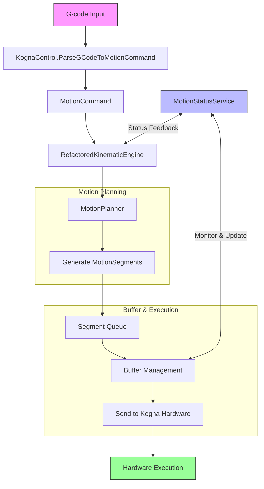

# G-Code to Motion Execution Process

## Table of Contents
1. [G-Code Input and Parsing](#1-g-code-input-and-parsing)
   - [1.1 Command Reception](#11-command-reception)
   - [1.2 G-Code Parsing](#12-g-code-parsing)
   - [1.3 MotionCommand Creation](#13-motioncommand-creation)
2. [Motion Planning](#2-motion-planning)
   - [2.1 Kinematic Engine Processing](#21-kinematic-engine-processing)
   - [2.2 Trajectory Planning](#22-trajectory-planning)
   - [2.3 Motion Segmentation](#23-motion-segmentation)
3. [Buffer Management](#3-buffer-management)
   - [3.1 Segment Queue](#31-segment-queue)
   - [3.2 Buffer Status Monitoring](#32-buffer-status-monitoring)
   - [3.3 Buffer Management Commands](#33-buffer-management-commands)
4. [Hardware Communication](#4-hardware-communication)
   - [4.1 Command Formatting](#41-command-formatting)
   - [4.2 Time Synchronization](#42-time-synchronization)
5. [Motion Execution](#5-motion-execution)
   - [5.1 Segment Execution](#51-segment-execution)
   - [5.2 Status Updates](#52-status-updates)
6. [Error Handling and Recovery](#6-error-handling-and-recovery)
   - [6.1 Error Detection](#61-error-detection)
   - [6.2 Recovery Procedures](#62-recovery-procedures)
7. [Advanced Features](#7-advanced-features)
   - [7.1 Sensor Integration](#71-sensor-integration)
   - [7.2 Adaptive Motion](#72-adaptive-motion)
   - [7.3 Diagnostics and Monitoring](#73-diagnostics-and-monitoring)
8. [Performance Considerations](#8-performance-considerations)
   - [8.1 Timing Requirements](#81-timing-requirements)
   - [8.2 Resource Management](#82-resource-management)
   - [8.3 Real-time Performance](#83-real-time-performance)

## 1. G-Code Input and Parsing

### 1.1 Command Reception
- G-code commands are received through the `KognaControl` class in `Server.cs`
- Commands can originate from:
  - Direct user input via terminal
  - G-code file uploads
  - Programmatic generation from higher-level operations

### 1.2 G-Code Parsing
- The `ParseGCodeToMotionCommand` method processes each line of G-code
- Supports standard G-code commands including:
  - Linear moves (G0, G1)
  - Arc moves (G2, G3)
  - Dwell commands (G4)
  - Coordinate system selection (G54-G59)
  - Machine coordinate system (G53)

### 1.3 MotionCommand Creation
- Parsed G-code is converted into a `MotionCommand` object with:
  ```csharp
  public class MotionCommand
  {
      public int SequenceNumber { get; set; }
      public MotionType Type { get; set; }
      public double[] StartPosition { get; set; } = new double[8];
      public double[] EndPosition { get; set; } = new double[8];
      public double FeedRate { get; set; }
      public double Acceleration { get; set; }
      public double Jerk { get; set; }
      // Additional properties for arcs, dwell, etc.
  }
  ```

## 2. Motion Planning

### 2.1 Kinematic Engine Processing
- `RefactoredKinematicEngine` receives `MotionCommand` objects
- Applies coordinate system transformations if needed
- Validates motion against machine limits and constraints

### 2.2 Trajectory Planning
- `MotionPlanner` generates a smooth trajectory:
  - Calculates velocity and acceleration profiles
  - Implements trapezoidal velocity planning
  - Handles acceleration/deceleration ramps
  - Maintains constant velocity during straight segments

### 2.3 Motion Segmentation
- Trajectory is divided into `MotionSegment` objects:
  ```csharp
  public class MotionSegment
  {
      public string Id { get; set; } = Guid.NewGuid().ToString("N");
      public int SequenceNumber { get; set; }
      public MotionType Type { get; set; }
      public double[] StartPosition { get; set; } = new double[8];
      public double[] EndPosition { get; set; } = new double[8];
      public double FeedRate { get; set; }
      public double Acceleration { get; set; }
      public double Jerk { get; set; }
      public double Duration { get; set; }
      // Additional timing and status properties
  }
  ```

## 3. Buffer Management

### 3.1 Segment Queue
- Segments are placed in a thread-safe queue
- Target buffer size: 200ms of motion
- Queue is continuously monitored and maintained

### 3.2 Buffer Status Monitoring
- `BufferStatus` tracks:
  - Number of commands in buffer
  - Total buffer time
  - Buffer utilization percentage
  - Estimated time to empty
  - Current segment being executed

### 3.3 Buffer Management Commands
- Implements Kogna buffer protocol:
  - `OPENBUF`: Initialize buffer
  - `FLUSHBUF`: Clear buffer
  - `EXECBUF`: Start execution
  - Buffer state machine ensures proper sequencing

## 4. Hardware Communication

### 4.1 Command Formatting
- Segments are formatted into Kogna-specific commands:
  ```
  Linear X Y Z A B C X1 Y1 Z1 A1 B1 C1 F A J T [CorrelationId]
  ```
  - X,Y,Z,A,B,C: Start positions
  - X1,Y1,Z1,A1,B1,C1: End positions
  - F: Feed rate
  - A: Acceleration
  - J: Jerk
  - T: Duration
  - CorrelationId: For sensor data correlation

### 4.2 Time Synchronization
- Uses Kogna's `ExecTime` for precise timing
- Implements clock synchronization between host and controller
- Compensates for network and processing delays

## 5. Motion Execution

### 5.1 Segment Execution
- Segments are sent to Kogna hardware via `IKognaIO` interface
- Hardware executes segments with microsecond precision
- Real-time monitoring of execution progress

### 5.2 Status Updates
- `MotionStatusService` provides real-time feedback:
  - Current segment being executed
  - Buffer status
  - System state (idle, running, error)
  - Sensor data correlation

## 6. Error Handling and Recovery

### 6.1 Error Detection
- Hardware communication errors
- Buffer underruns
- Motion constraints violations
- Time synchronization issues

### 6.2 Recovery Procedures
- Automatic buffer refill
- Error reporting and logging
- Safe stop procedures
- Recovery from communication failures

## 7. Advanced Features

### 7.1 Sensor Integration
- Motion segments include correlation IDs
- Sensor data is timestamped and correlated with motion
- Enables closed-loop control and process monitoring

### 7.2 Adaptive Motion
- Dynamic adjustment of motion parameters
- Real-time feedrate override
- Lookahead for smooth motion planning

### 7.3 Diagnostics and Monitoring
- Comprehensive logging
- Real-time performance metrics
- Execution profiling
- Buffer utilization statistics

## 8. Performance Considerations

### 8.1 Timing Requirements
- 200Hz motion update rate (5ms cycle time)
- Sub-millisecond command latency
- Microsecond-level timing precision

### 8.2 Resource Management
- Efficient memory usage for motion segments
- Thread-safe buffer management
- Minimal garbage collection pressure

### 8.3 Real-time Performance
- Prioritized execution of time-critical tasks
- Lock-free algorithms where possible
- Bounded execution times for all operations

## Mermaid Diagram


