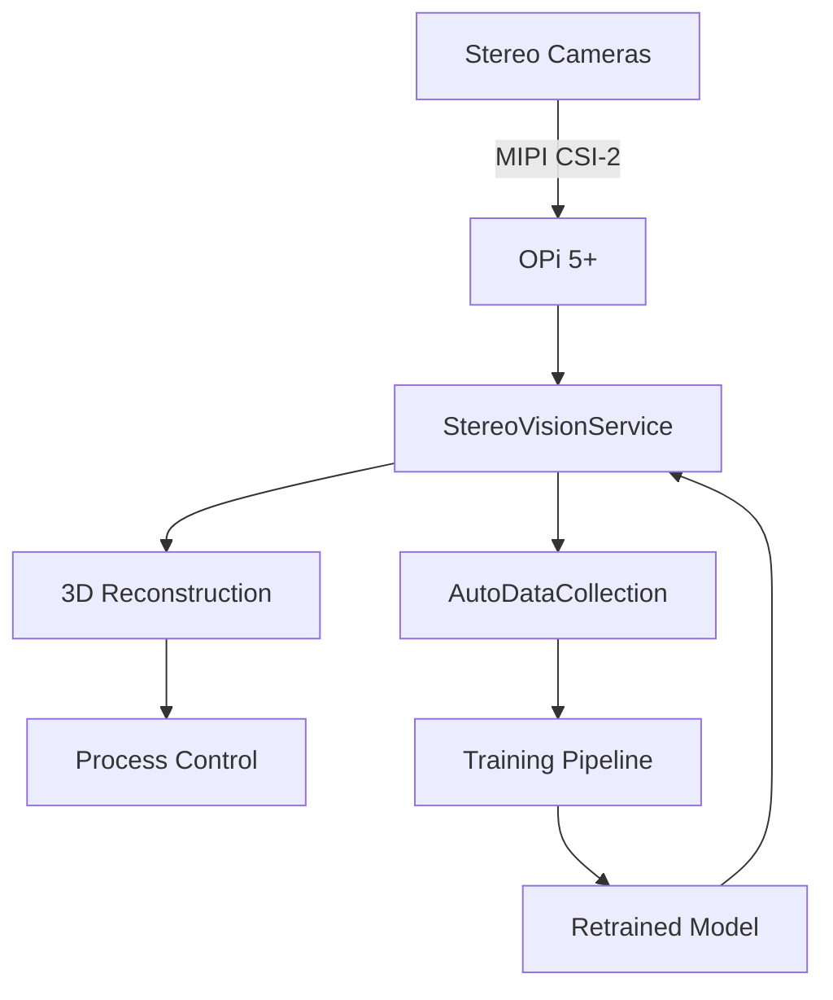

# Stereo Vision System for Additive Manufacturing

## Table of Contents
1. [Overview](#overview)
2. [System Architecture](#system-architecture)
3. [Hardware Setup](#hardware-setup)
4. [Software Installation](#software-installation)
5. [Configuration](#configuration)
6. [Calibration](#calibration)
7. [Data Collection](#data-collection)
8. [Model Training](#model-training)
9. [Deployment](#deployment)
10. [Monitoring](#monitoring)
11. [Troubleshooting](#troubleshooting)

## Overview

The Stereo Vision System provides real-time 3D monitoring of the deposition process, enabling precise control and quality assurance. It consists of:

- Dual AR0234 global shutter cameras
- Stereo calibration and rectification
- Deep learning-based 3D reconstruction
- Automatic data collection and model retraining

## System Architecture



## Hardware Setup

### Requirements
- Orange Pi 5+ with NPU
- 2× AR0234 global shutter cameras
- NIR bandpass filters (940nm)
- Calibration target (chessboard)
- Proper lighting (NIR illuminators recommended)

### Camera Mounting
1. Position cameras with ~60mm baseline
2. Ensure parallel optical axes
3. Secure all connections
4. Install NIR filters

## Software Installation

### Dependencies
```bash
# On OPi 5+
sudo apt update
sudo apt install -y python3-pip python3-opencv
pip3 install torch torchvision onnxruntime numpy pillow tqdm

# For model training (on a more powerful machine)
pip3 install torch==2.0.1+cu118 torchvision==0.15.2+cu118 --extra-index-url https://download.pytorch.org/whl/cu118
```

### Build and Deploy
```bash
# Clone repository
git clone https://github.com/yourorg/kogna-controller.git
cd kogna-controller

# Build and publish
dotnet publish -c Release -r linux-arm64 --self-contained true
```

## Configuration

### Camera Configuration (`appsettings.json`)
```json
{
  "StereoVision": {
    "LeftCamera": {
      "DeviceId": "/dev/video0",
      "Width": 1920,
      "Height": 1200,
      "Fps": 60
    },
    "RightCamera": {
      "DeviceId": "/dev/video1",
      "Width": 1920,
      "Height": 1200,
      "Fps": 60
    },
    "CalibrationFile": "config/stereo_calibration.json"
  },
  "AutoDataCollection": {
    "Enabled": true,
    "OutputDirectory": "data/auto_collected",
    "MinConfidence": 0.7
  },
  "ModelRetraining": {
    "Enabled": true,
    "CheckIntervalHours": 1,
    "MinSamplesForRetraining": 100
  }
}
```

## Calibration

### Run Calibration Tool
```bash
python3 tools/StereoCalibration/calibrate.py \
  --left-camera 0 \
  --right-camera 1 \
  --output config/stereo_calibration.json \
  --pattern-width 9 \
  --pattern-height 6 \
  --square-size 25
```

### Calibration Process
1. Print a chessboard pattern
2. Move it through the workspace
3. Capture 20-30 images
4. Verify calibration accuracy

## Data Collection

### Manual Collection
```bash
python3 tools/DataCollection/collect_stereo_data.py \
  --output-dir data/manual_collected \
  --left-cam 0 \
  --right-cam 1
```

### Automatic Collection
Enable in config:
```json
{
  "AutoDataCollection": {
    "Enabled": true
  }
}
```

## Model Training

### Prepare Dataset
```bash
python3 tools/DataCollection/process_auto_data.py \
  --input-dir data/auto_collected \
  --output-dir data/processed
```

### Train Model
```bash
python3 src/Services/Vision/StereoNet/train_stereo_net.py \
  --data-dir data/processed \
  --output models/stereo_net.onnx \
  --epochs 100 \
  --batch-size 16
```

## Deployment

### Update Model
1. Place new model in `models/`
2. Update config:
```json
{
  "StereoVision": {
    "ModelPath": "models/stereo_net.onnx"
  }
}
```
3. Restart the service

## Monitoring

### Logs
```bash
# View logs
journalctl -u kogna-controller -f

# Check service status
systemctl status kogna-controller
```

### Metrics
- Frame rate
- Processing latency
- Model confidence
- Data collection statistics

## Troubleshooting

### Common Issues

#### Cameras Not Detected
1. Check connections
2. Verify device permissions:
   ```bash
   ls -l /dev/video*
   sudo usermod -aG video $USER
   ```
3. Test with v4l2-ctl:
   ```bash
   v4l2-ctl --list-devices
   v4l2-ctl --device=/dev/video0 --all
   ```

#### Poor Reconstruction Quality
1. Recalibrate cameras
2. Check lighting conditions
3. Verify focus
4. Clean lenses

#### High Latency
1. Reduce image resolution
2. Enable hardware acceleration
3. Check system load

### Support
For additional help, contact:
- Email: support@kogna.tech
- GitHub: https://github.com/yourorg/kogna-controller/issues
